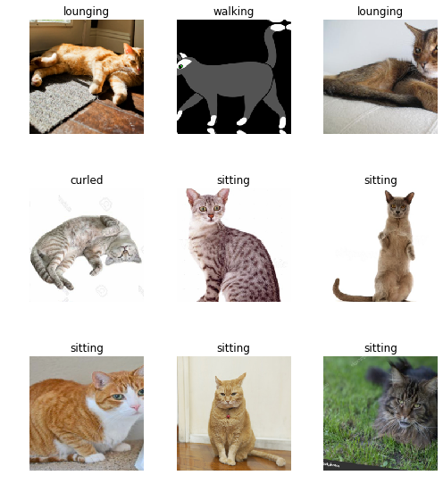
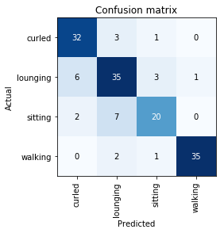
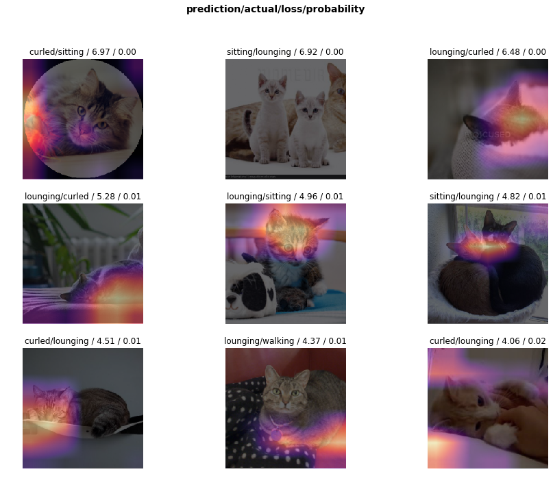

During a spare hour I decided to see how fast I could prototype something with the fast.ai library. The library is impressive, I can't say otherwise. Very quickly I got a working prototype. The result was a fairly decent model to recognize the posture of a cat.

<!--more-->
## Fast.ai library
Recently I've decided to take a look at [fast.ai](https://course.fast.ai), their course and their library. The best way to do this is to try something and it's very likely you'll end up with a cat-related topic. With my desk oriented towards the spot my cat was chilling, I decided to take the library for a spin and recognize cat postures.

To make the post self-contained I'll note the snippets of code needed. As you'll see it's actually very little code - and every line is clear on what it does.

Note: Most of the code was copied from the example notebook in the course of fast.ai.
```python
from fastai.vision import *
from fastai.metrics import error_rate
```

## The postures
I picked the first four postures that came to mind:

* Lounging
* Curled up
* Sitting
* Walking



## Getting the data
There are some pictures of my cat but not sufficient. He is very lazy and is predominantly curled up.
In the course of fast.ai they discussed the option to just use Google searches to get a dataset quickly. I have done this before, but they had some nice helpers to really make it a smooth experience:

1) Do a Google Image search yourself. For example, search for "cats curled up"

2) Run a JavaScript script they supply and obtain a file with urls
```javascript
urls = Array.from(document.querySelectorAll('.rg_di .rg_meta')).map(el=>JSON.parse(el.textContent).ou);
window.open('data:text/csv;charset=utf-8,' + escape(urls.join('\n')));
```
3) Run a function from their library to download and verify the images
```python
download_images('path/urls_cats.csv', 'path/where/to/download/images', max_pics=200)
verify_images('path/where/to/download/images', delete=True, max_size=500)
```
4) Create a dataset
```python
np.random.seed(42) # Set a fixed seed to always get the same train-validation split
data = ImageDataBunch.from_folder("path/to/images", train=".", valid_pct=0.2,
        ds_tfms=get_transforms(), size=224, num_workers=4).normalize(imagenet_stats)
```

## Training the neural network
Training the neural network is actually very simple

5) Create the neural network:
```python
learn = cnn_learner(data, models.resnet50, metrics=error_rate)
```

6) Find a a good learning rate:
```python
learn.lr_find(start_lr=1e-4)
learn.recorder.plot()
```

7) Train the neural network:
```python
learn.fit_one_cycle(12, max_lr=2e-2)
```
There are some additional steps you can take to further finetune the model, but notice how easy it is?
## Performance
The performance was actually quite decent: an error rate of 17%. Especially if you realize that the the distinction between classes is fuzzy and can be subtle.
The images that the google search returned quite often confused lounging with curled up and sitting with lounging.

Even I'm not totally clear on the distinction between lounging and curled up in some cases :)

```python
interp = ClassificationInterpretation.from_learner(learn)
interp.plot_confusion_matrix()
```


Let's plot the images the model was the most confused about, and highlight the areas that the model was focused on:

```python
interp.plot_top_losses(9, figsize=(15,11))
```



## Improvements
As you can see in the top losses, the samples contain some images that are no good: multiple cats or to far zoomed in. The easiest thing to do would be to get a better dataset and make a clear distinction between the classes.

## How does it work
The cool thing fast.ai did in their course is to encode as many best practices in the library as they can.
This means that you don't start with a neural network from scratch: you take a network architecture that is tested in practices, is pretrained and _you get sensible defaults_.

In my case I used [ResNet50](https://www.kaggle.com/keras/resnet50) and then fine-tuned it with the cat data.
This means you're getting a lot for free!
